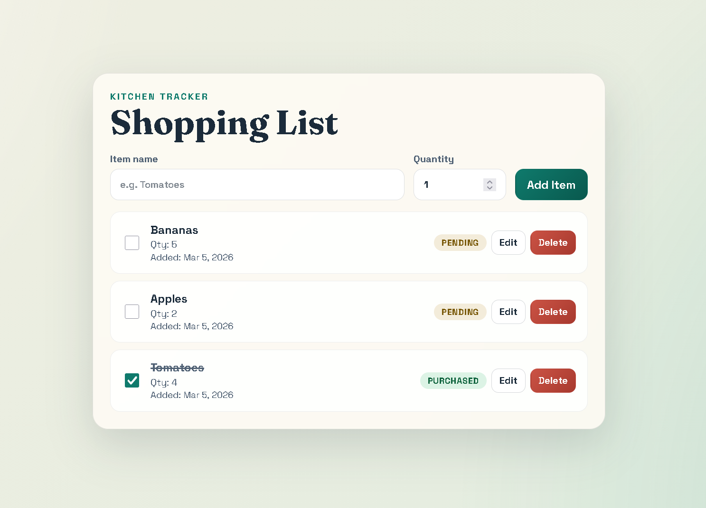

# Shopping List

A simple and intuitive shopping list web application built with React and ASP.NET.



## Features

- Add items to your shopping list
- Mark items as completed
- Delete items
- Persistent storage
- Redux state management

## Tech Stack

- **Frontend**: React
- **Backend**: ASP.NET

## Getting Started

### Prerequisites

- Node.js
- .NET SDK

### Installation

1. Clone the repository
2. **Restore dependencies:**

   ```bash
   dotnet restore
   ```

3. Build and run the app:

   ```bash
   dotnet build
   dotnet run
   ```

4. Install the frontend dependencies

   ```bash
   npm install
   ```

5. Start the frontend server:
   ```bash
   npm run dev
   ```

## Usage

1. Enter an item name and click "Add"
2. Check off completed items
3. Remove items as needed
